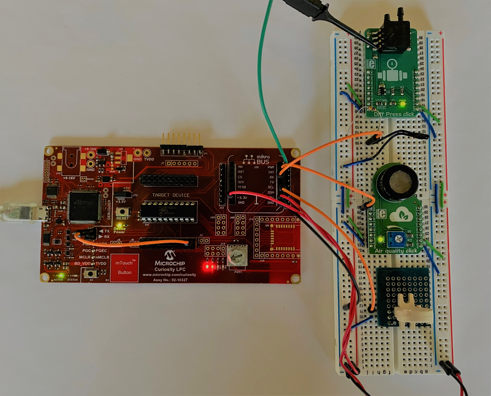
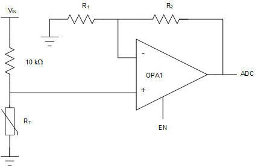
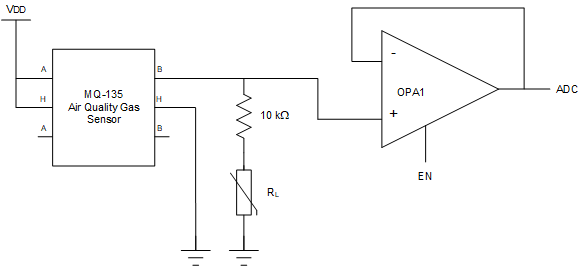
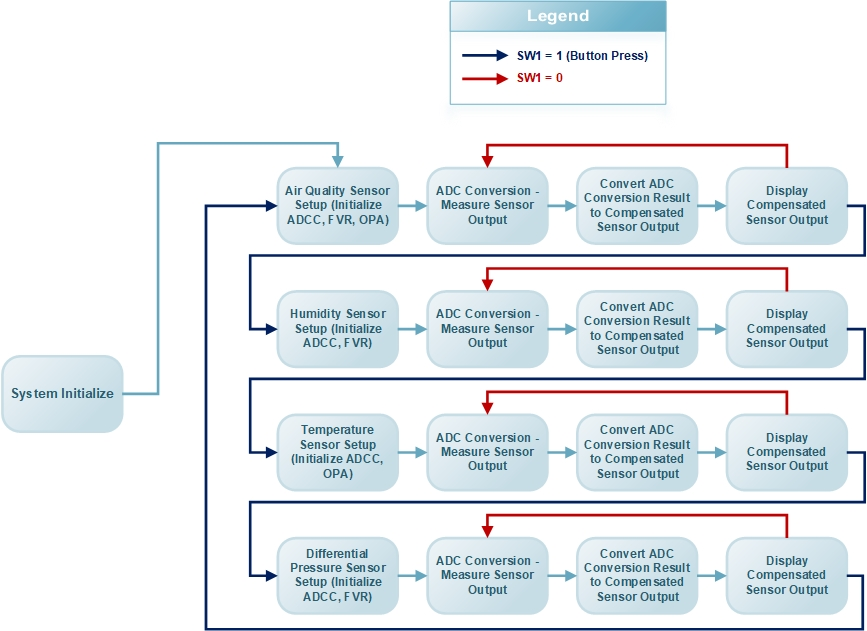
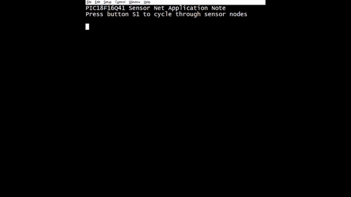

<a href="https://www.microchip.com" rel="nofollow"></a>

# Related Documentation:
This project is related to [ANxxxx] (insert link here): Analog Sensor Measurement and Acquisition. Refer to the application note for more details.

# Objective:
The "pic18f16q41-analog-sensor-net" project highlights the advanced analog peripherals found on the PIC18-Q41 family of devices, and demonstrates using those peripherals to create an analog sensor net for residential environmental monitoring. The analog sensor net is comprised of a temperature sensor (thermistor), an air quality sensor, a differential air pressure sensor, and a capacitive humidity sensor. The main idea behind the sensor net is to take a group of dispersed sensors and connect them centrally where the data can be collected and monitored. Each component in the analog sensor net is treated in a modular nature in both firmware and hardware and should be considered as individual nodes, making it simple to add or remove sensors to the net as needed. This code example uses the 12-bit Analog to Digital Converter with Computation (ADCC), the Capacitive Voltage Divider built into the ADCC, the Operational Amplifier (OPA) module, the Fixed Voltage Reference (FVR) module, and the Universal Asynchronous Receiver / Transmitter (UART) module. Each particular component of the analog sensor net requires a unique interface depending on the characteristics of the sensor, and the peripherals used have a unique initialization routine for each sensor that is called as the user cycles through nodes in the application.

# Software Used:
  - MPLAB® X IDE 5.40 or newer [(microchip.com/mplab/mplab-x-ide)](http://www.microchip.com/mplab/mplab-x-ide)
  - MPLAB® XC8 2.20 or a newer compiler [(microchip.com/mplab/compilers)](http://www.microchip.com/mplab/compilers)
  - MPLAB® Code Configurator (MCC) 3.95.0 or newer [(microchip.com/mplab/mplab-code-configurator)](https://www.microchip.com/mplab/mplab-code-configurator)
  - MPLAB® Code Configurator (MCC) Device Libraries PIC10 / PIC12 / PIC16 / PIC18 MCUs [(microchip.com/mplab/mplab-code-configurator)](https://www.microchip.com/mplab/mplab-code-configurator)
  - Microchip PIC18F-Q Series Device Support (1.5.124) or newer [(packs.download.microchip.com/)](https://packs.download.microchip.com/)

# Hardware Used:
  - [PIC18F16Q41 Microcontroller](https://www.microchip.com/wwwproducts/en/PIC18F16Q41)
  - [Curiosity Low Pin Count (LPC) Development Board](https://www.microchip.com/DevelopmentTools/ProductDetails/DM164137)
  - [Vishay 10 kΩ NTC Thermistor](http://www.vishay.com/docs/29078/ntcle413.pdf)
  - [Vishay Humidity-Sense-E Capacitive Humidity Sensor](http://www.vishay.com/docs/29001/23226919.pdf)      
  - [NXP Integrated Silicon Pressure Sensor](https://www.nxp.com/docs/en/data-sheet/MPXV7007.pdf)
  - [MikroElektronika Air Quality Click Board](https://www.mikroe.com/air-quality-click)
  - 10 kΩ Resistor (Used for temperature sensor circuit interface)

# Demo Configuration:
The Curiosity Low Pin Count (LPC) Development Board (Part # DM164137) was selected as the development platform for this code example. The analog sensor net is comprised of four different sensors that each provide an analog output voltage representative of the physical property they are measuring. The analog output from each sensor was connected using jumper wires to each respective analog input on the PIC18F16Q41 microcontroller. The Operational Amplifier (OPA) module was used for two of the four sensor interfaces in this example, so the analog output of those sensors were connected to the designated non-inverting operational amplifier pins (OPA1IN+). The analog outputs of the other two sensors were measured directly using the ADC, so those signals were connected directly to the designated analog channels on the PIC18F16Q41. The sensor output results are displayed using the UART module, and the TX pin selected for the UART was RB7. The virtual communication port on the Curiosity LPC development board was used as the UART to USB bridge, so the TX pin on the microcontroller (RB7) was connected using a jumper wire to the corresponding TX pin on the virtual COM port. The following table summarizes the signal connections used in this code example:

|Signal                             | Micrcontroller Pin        |
|-----------------------------------|:-------------------------:|
|Temperature Sensor                 | RB5 (OPA Input, OPA1IN0+)  |
|Humidity Sensor Output             | RB6 (ADC Positive Input)  |
|Differential Air Pressure Output   | RC5 (ADC Positive Input)  |
|Air Quality Sensor Output      	  | RA2 (OPA Input, OPA1IN2+)  |
|UART TX                         	  | RB7                       |
|Curiosity LPC Switch 1 (SW1)       | RC4                       |

### Curiosity LPC Project Setup:
</a>

# Temperature Sensor:
The temperature sensor used in this code example was a 10 kΩ thermistor in conjunction with a 10 kΩ resistor to form a voltage divider circuit. The output of the voltage divider was amplified using the internal operational amplifier (OPA) module on the PIC microcontroller to achieve a gain of 2. The amplified signal from the OPA module was connected internally to the ADCC so that the analog voltage can be converted to a digital value. The resulting voltage was used to calculate the resistance of the thermistor. The characteristic data provided by the thermistor datasheet along with the Steinhart–Hart model equation were used to convert the calculated thermistor resistance to temperature in degrees Celsius. The following figure shows the circuit used to measure temperature in this example:

### Sensor Interface Circuit:
</a>

The OPA module was used in this sensor interface as a non-inverting programmable gain amplifier as illustrated in the circuit above. The feedback network was provided using the internal resistor ladder of the peripheral. The ADCC module was used in basic mode for this sensor interface, and the positive reference voltage to the ADC was 5.0V derived from VDD. The initialization routines used to setup the OPA and ADCC peripherals are shown below. The temperature was derived by measuring the output voltage of the interface circuit using the ADC. The raw ADC conversion result was then converted to volts, and that value was used to determine the resistance of the thermistor. The thermistor resistance was then used to calculate the temperature using a compensation routine based on the Steinhart–Hart model equation. Please refer to the related application note for more information regarding the acquisition and compensation of this sensor data.

### Temperature Sensor ADCC Initialization Code:
```c
void Temp_ADCC_Init(void) {
    // Temp Indicator ADCC Sensor Settings
    ADCON1 = 0x00;
    ADCON2 = 0x00;
    ADCON3 = 0x00;
    ADREF = 0x00; // ADCC Negative Ref = VSS; ADCC Positive Ref = VDD
    ADACT = 0x00; // ADCC Auto-Conversion Trigger;
    ADCLK = 0x00; // ADCC Clock Divider Register;
    ADPCH = 0x8D; // ADCC Positive Channel = OPA1OUT; PCH = OPAIN0+(RB5)
    ADCON0 = 0x84; // ADCC Enabled; FOSC/ADCLK; Results Right Justified;
    PIR1bits.ADIF = 0; // Clear ADIF;
    PIE1bits.ADIE = 1; // Enable ADCC Interrupts;
}
```
### Temperature Sensor OPA Initialization Code:
```c
void Temp_OPA_Init(void) {
    // MQ135 OPA Sensor Settings
    OPA1CON1 = 0x3F; // RESON Enabled; NSS = VSS; GSEL = 8R / 8R (Gain = 2)
    OPA1CON2 = 0x12; // NCH = Internal Resistor Ladder; PCH = OPA1INx+
    OPA1CON3 = 0x80; // FMS = OPAxOUT; PSS = ADC1PCH (See ADPCH Register)
    OPA1HWC = 0x00; // Hardware Controlled Override Disabled;
    OPA1ORS = 0x00;
    OPA1CON0 = 0x80; // OPA Enabled; User-defined Feedback;
}
```
# Relative Humidity Sensor:
The humidity sensor used in this code example was a capacitive sensor whose capacitance changes in relation to the relative humidity in the environment where it is placed. The capacitance of the humidity sensor ranges anywhere from 110pF to 160pF allowing it to be used to accurately measure relative humidity based on the resulting capacitance of the component. The capacitive voltage divider feature of the ADCC was used to measure the relative capacitance of the sensor. Several reference capacitors of known value were measured to provide a baseline that can be used to determine the relative capacitance of a component using the raw ADC conversion result. The humidity sensor datasheet provides a characteristic curve that describes the relationship between the capacitance of the sensor in pF versus the relative humidity as a percentage. The humidity sensor used in this code example is a two terminal device, and one terminal was connected to an analog channel of the PIC18F16Q41 while the other terminal was connected to ground. The ADC was configured to be used in its capacitive voltage divider mode, and the positive reference voltage was 4.096V supplied by the Fixed Voltage Reference (FVR). The initialization routines used to setup the ADCC and FVR peripherals for this sensor interface are shown below. Please refer to the related application note for more information regarding the acquisition and compensation of this sensor data.

### Humidity Sensor ADCC Initialization Code:
```c
void Humid_ADCC_Init(void) {
    // Humidity Sensor ADCC Sensor Settings
    ADCON1 = 0x01; // Double Sampling Enabled;
    ADCON2 = 0x00;
    ADCON3 = 0x00;
    ADPREL = 0x0A; // ADCC Pre-charge Time
    ADACQL = 0x0A; // ADCC Acquisition Time;
    ADCAP = 0x1F; // Additional Sample and Hold = 31pf;
    ADREF = 0x03; // ADCC Negative Ref = VSS; ADCC Positive Ref = FVR (4.096 V)
    ADACT = 0x00; // ADCC Auto-Conversion Trigger = TMR0;
    ADCLK = 0x00; // ADCC Clock Divider Register;
    ADPCH = HUMID; // RB6
    ADCON0 = 0x84; // ADCC Enabled; Continuous Operation Enabled;; Results Right Justified;
    PIR1bits.ADIF = 0; // Clear ADIF;
    PIE1bits.ADIE = 1; // Enable ADCC Interrupts;
}
```

### Humidity Sensor FVR Initialization Code:
```c
void Humid_FVR_Init(void) {
    FVRCONbits.ADFVR = 0b11; // FVR Buffer 1 Gain is 4.096V;
    FVRCONbits.CDAFVR = 0b00; // FVR Buffer 2 Gain is off;
    FVRCONbits.EN = 1; // Enable FVR;
}
```

# Differential Air Pressure Sensor:
The differential air pressure sensor used in this code example utilizes a piezo resistive transducer, and outputs an analog voltage linearly proportional to the differential pressure measured between the two physical input ports of the sensor. The analog output voltage of the sensor was converted to differential air pressure in kPa using a compensation routine provided in the sensor datasheet. The pressure sensor used in this code example measures differential air pressure between -7 kPa and 7 kPa. The differential air pressure provided by the sensor is a result of the difference in absolute air pressure between the two physical input ports attached to the sensor package. The ADCC was used in basic mode to convert the analog output voltage of the sensor to a digital value. The positive reference to the ADCC was 4.096V which was supplied by the fixed voltage reference. The initialization routines used to setup the ADCC and FVR peripherals for this sensor interface are shown below. Please refer to the related application note for more information regarding the acquisition and compensation of this sensor data.

### Differential Pressure Sensor ADCC Initialization Code:
```c
void Press_ADCC_Init(void) {
    // MQ7 ADCC Sensor Settings
    ADCON1 = 0x00;
    ADCON2 = 0x00;
    ADCON3 = 0x00;
    ADREF = 0x03; // ADCC Negative Ref = VSS; ADCC Positive Ref = FVR (4.096 V)
    ADACT = 0x00; // ADCC Auto-Conversion Trigger = TMR0;
    ADCLK = 0x00; // ADCC Clock Divider Register;
    ADPCH = PRESS; // PCH = PRESS; RC5;
    ADCON0 = 0x94; // ADCC Enabled; ADC Dedicated OSC; Results Right Justified;
    PIR1bits.ADIF = 0; // Clear ADIF;
    PIE1bits.ADIE = 1; // Enable ADCC Interrupts;
}
```

### Differential Pressure Sensor FVR Initialization Code:
```c
void Press_FVR_Init(void) {
    FVRCONbits.ADFVR = 0b11; // FVR Buffer 1 Gain is 4.096V;
    FVRCONbits.CDAFVR = 0b00; // FVR Buffer 2 Gain is off;
    FVRCONbits.EN = 1; // Enable FVR;
}
```

# Air Quality Gas Sensor:
The air quality sensor used in this code example is the MQ-135 gas sensor. This sensor outputs a raw analog output voltage that represents the concentration of harmful gases in the surrounding air. This gas sensor is sensitive to several different harmful gases, but in this code example the sensor was used to detect the presence of carbon monoxide gas. The MQ-135 datasheet provides a characteristic curve that describes the analog output voltage behavior when exposed to different concentrations of harmful gases. This information was used to convert the raw analog output voltage from the gas sensor to carbon monoxide concentration in parts per million (PPM). The Operational Amplifier (OPA) module of the PIC18F16Q41 was used in a unity gain configuration to buffer the analog signal from the sensor prior to being converted by the ADC. The ADCC peripheral was used in basic mode, and the ADC positive reference was 4.096V provided by the Fixed Voltage Reference (FVR) peripheral. The circuit used to connect the MQ-135 gas sensor to the microcontroller, and the initialization code for each of the peripherals used in this sensor interface is shown below. Please refer to the related application note for more information regarding the acquisition and compensation of this sensor data.

### Air Quality Sensor Interface Circuit:
</a>

### Air Quality Sensor ADCC Initialization Code:
```c
void MQ135_ADCC_Init(void) {
    // MQ135 ADCC Sensor Settings
    ADCON1 = 0x00;
    ADCON2 = 0x00;
    ADCON3 = 0x00;
    ADREF = 0x03; // ADCC Negative Ref = VSS; ADCC Positive Ref = FVR (4.096 V)
    ADACT = 0x00; // ADCC Auto-Conversion Trigger = TMR2;
    ADCLK = 0x00; // ADCC Clock Divider Register;
    ADPCH = 0x82; // ADCC Positive Channel = OPA1OUT; PCH = OPAIN2+(RA2)
    ADCON0 = 0x94; // ADCC Enabled; ADC Dedicated OSC; Results Right Justified;
    PIR1bits.ADIF = 0; // Clear ADIF;
    PIE1bits.ADIE = 1; // Enable ADCC Interrupts;
}
```
### Air Quality Sensor FVR Initialization Code:
```c
void MQ135_FVR_Init(void) {
    FVRCONbits.ADFVR = 0b11; // FVR Buffer 1 Gain is 4.096V;
    FVRCONbits.CDAFVR = 0b00; // FVR Buffer 2 Gain is off;
    FVRCONbits.EN = 1; // Enable FVR;
}
```
### Air Quality Sensor OPA Initialization Code:
```c
void MQ135_OPA_Init(void) {
    // MQ135 OPA Sensor Settings
    OPA1CON1 = 0x00; // RESON Disabled;
    OPA1CON2 = 0x02; // NCH = No Connection; PCH = OPA1INx+
    OPA1CON3 = 0x00; // FMS = No Connection; PSS = ADC1PCH (See ADPCH Register)
    OPA1HWC = 0x00; // Hardware Controlled Override Disabled;
    OPA1ORS = 0x00;
    OPA1CON0 = 0x88; // OPA Enabled; Unity Gain Mode;
}
```

# Analog Sensor Net Description and User Interface:
This code example uses four analog sensors, each with its own sensor interface and unique peripheral configuration. Once the device powers up after being programmed and the system has been initialized, the application state machine will begin executing. The user can advance to the next sensor in the net by pressing the pushbutton labeled "S1" on the curiosity LPC development board. As the user switches between sensors in this code example, the peripherals used for each interface must be reinitialized prior to measuring and displaying the output of the next sensor. The "pic18f16q41-analog-sensor-net" state machine is shown below. For more information about the state machine, user interface, or implementation of this code example please refer to the complete application note.

### Analog Sensor Net State Machine:
</a>

# Analog Sensor Net Output results:
The UART peripheral was used to display the compensated output data for each sensor in this code example. The clip below shows what the output should look like when cycling through sensors.

</a>
